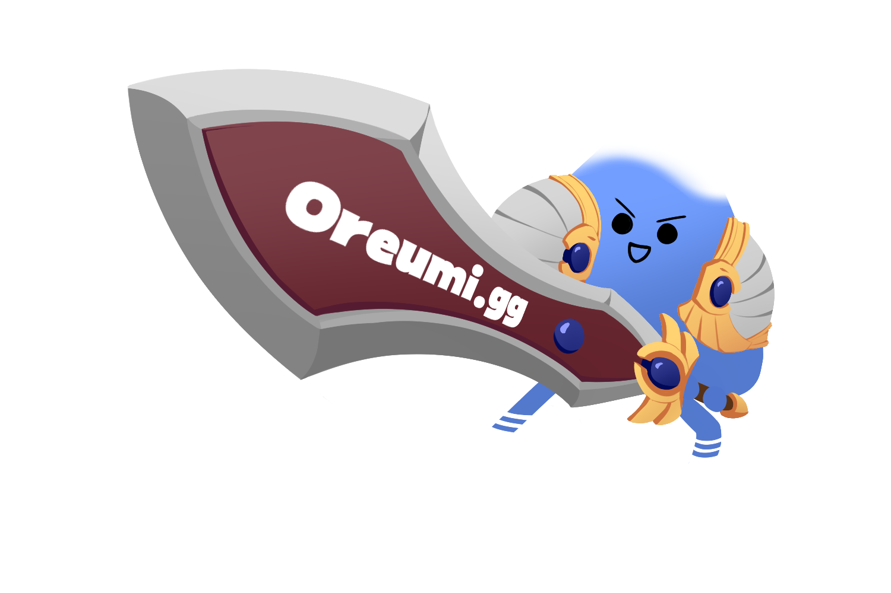

# **Oreumi 롤 전적검색**

## **📗 목차**

<b>

- 📝 [개요](#-포트폴리오-개요)
- 🛠 [기술 및 도구](#-기술-및-도구)
- 🔗 [링크](#-링크)
- ✨ [업데이트](#-업데이트)
- 👨🏻‍💻 [기능 구현](#-기능-구현)
  - [반응형 웹](#1-반응형 웹)
  - [롤전적검색](#2-롤전적검색)
  - [로그인 Email 전송 / social 로그인](#3-로그인 Email 전송 / social 로그인)
  - [챔피언분석](#4-챔피언분석)
  - [커뮤니티](#5-커뮤니티)
  - [AWS and git action 배포](#6-AWS and git action 배포)


- 🚀 [배포](#-배포)
- ⏰ [커밋 히스토리](#-커밋-히스토리)

</b>

## **📝 포트폴리오 개요**



> **프로젝트:** 오르미2기 파이널프로젝트 롤 전적검색 
>
> **기획 및 제작:** 조장(홍영욱), 강민서, 구영재, 김유성, 김정윤, 황찬혁
>
> **분류:** 팀 프로젝트
>
> **제작 기간:** 2023.10.16 ~ 10.31
>
> **배포일:** 2023.10.20. 
>
> **주요 기능:** 반응형 웹, 롤전적검색, 챔피언분석, 로그인 Email 전송, 커뮤니티, 배포 및 커스텀 도메인 연결
>
> **사용 기술:** html,css,Django, postgreSql, bs4, selenium, pandas
>
> **문의:** youngwook616@mgail.com

<br />

## **🛠 기술 및 도구** https://msdio.github.io/stackticon/#/
> **프론트:**
> [](https://github.com/msdio/stackticon)
> **백엔드:**
> [](https://github.com/msdio/stackticon)
> **기타:**
> [](https://github.com/msdio/stackticon)
<br />

## **🔗 링크**

**링크:** [https://oreumi.shop](https://oreumi.shop)

<br />

## **👨🏻‍💻 기능 구현**

### **1. 반응형 웹**
### **2. 롤전적검색**
### **3. 로그인 Email 전송 / social 로그인**
### **4. 챔피언분석**
### **5. 커뮤니티**
### **6. AWS and git action 배포**


## **🚀 배포**


- 수정 후 배포

```
$ 
$ 
```

- 커스텀 도메인: gabia에서 커스텀 도매인 구매(https://domain.gabia.com/)

<br />

## ⏰ 커밋 히스토리

[내 커밋 히스토리 보러가기](https://github.com/animalwook/Oreumi.gg/commits/main)
<br/>
<br/>
<br/>
